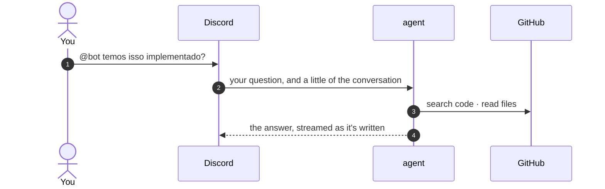
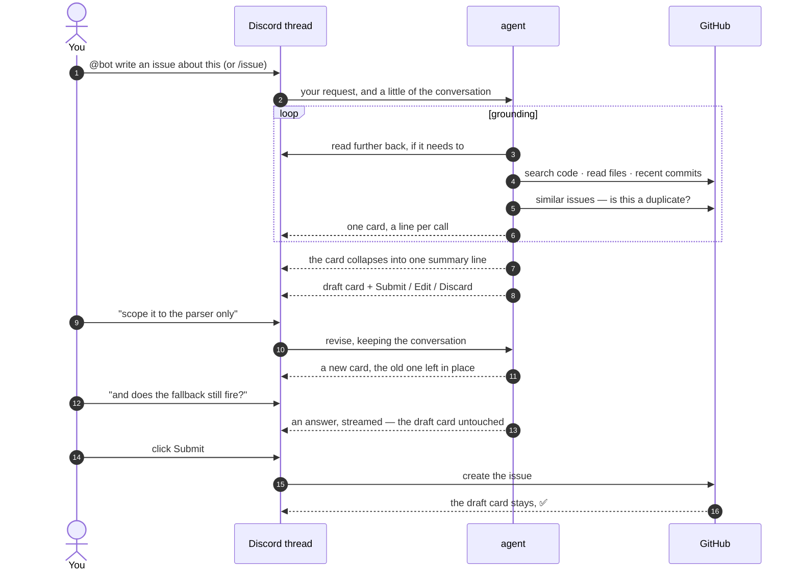

# Talking to the agent

`@` the bot and it answers, like anyone else in the channel. It reads the
conversation, greps the actual code to ground itself, and replies — streaming the
answer as it writes it. Ask it a question and you get an answer; ask it for an
issue and you get a draft you can argue with, in a thread, in front of everyone
who was in the discussion.

Which of those you get is the **agent's** decision, not a keyword match here.
There is no "issue mode" to be in or out of.

!!! danger "The agent cannot write to GitHub"

    There is no create-issue tool on the agent. Every tool it has is read-only,
    and submitting is the **cog's** job, behind a human click. A confused model
    can waste tokens; it cannot open an issue. That isn't a policy or a system
    prompt you're trusting — it's the shape of the code.

    This holds however the draft got there. A draft the agent proposed because
    you asked it to in conversation lands on exactly the same card, with the same
    Submit button, as one from `/issue`.

## The flow

Asking it a question is the short version: it reads, it looks things up, it
answers in the channel.



Asking it for an issue is the long one, because an issue is reviewed before it
exists:



The thread is the point: everyone in the conversation can watch the draft take
shape, but only whoever asked for it can act on it.

Note the two different kinds of turn in there. A request to change the issue
produces a new card; a question produces an answer and **leaves the card alone**.
The issue is an artifact of the conversation, not the only thing it can produce.

## Reaching it

Three ways in. Mentioning it is the general one — you can ask it anything. The
other two go straight to an issue, for when that's already what you want.

=== "Mention it"

    **`@bot` plus whatever you want to say.**

    ```text
    @bot temos on_message implementado?
    @bot vamos escrever uma issue sobre isso, considere essa conversa
    ```

    What it starts with is deliberately small. **Reply** to a message and it gets
    that message and your request — a reply is you pointing at something. Without
    a reply it gets the last few messages, just to orient itself.

    From there it reads back on its own with `read_conversation`, as far as it
    decides it needs to. You don't have to choose a number, and you don't have to
    copy a message link: if it can't tell what "isso" means, it goes and looks.

=== "Slash command"

    ```text
    /issue [prompt:‹what it's about›] [since_message:‹link›] [last:20] [repo:‹owner/name›]
    ```

    | Parameter | Description |
    | :-------- | :---------- |
    | `prompt` | What the issue is about — steers the draft. Optional but worth it |
    | `since_message` | A message **link** — reads from there forward. Right-click → *Copy Message Link* |
    | `last` | How many messages to read (default 20, max 100). Ignored with a link |
    | `repo` | Force the target repo instead of inferring it from the channel |

=== "Right-click a message"

    **Right-click a message → Apps → Draft issue from here.**

    A modal asks what the issue is about, then it drafts from that message
    forward — the same as passing `since_message`. Picking the message where a
    discussion started is usually faster than counting how many messages it ran
    for.

!!! tip "A link beats a count"

    `last:20` makes you guess how far back the discussion goes. A message link
    says *start here* and reads forward to the end of the conversation (up to
    100 messages), which is almost always what you meant.

### What it reads

The transcript is what people actually wrote, oldest first, with each speaker
named the way the agent will see them again. Alongside the text:

- [x] **Images** are downloaded and sent to the model as image content — a
      screenshot of a stack trace is read, not ignored.
- [x] **Text and JSON attachments** are inlined in full, and if one is too long
      the transcript says so in-band, so the model can't mistake the first
      100k characters for the whole file.
- [x] **Other attachments** are noted by name and type.
- [ ] **Bot messages are skipped** — otherwise the bridge's own notification
      cards read as conversation and it drafts issues about them.

Attachments come back as bytes rather than CDN links: Discord signs its URLs
with an expiry, so handing one to a model's fetcher works until it silently
doesn't.

## What the agent does

It reads the conversation, then uses read-only tools to ground what it says in
the code — because an answer or an issue that cites `path/to/file.py:41` is one
you can check, and one that paraphrases a hunch isn't.

| Tool | What it's for |
| :--- | :------------ |
| `read_conversation` | read further back in this channel, when what you meant isn't in what it was given |
| `list_repos` | which repos it can actually read — the only tool that settles "do you have access to X" |
| `search_code` | find a symbol or string across the org |
| `read_file` | read a file, optionally at a branch, tag or commit |
| `list_dir` | get oriented before reading |
| `recent_commits` | did this regress? who touched it last? |
| `similar_issues` | is this already filed? |
| `list_issues` | the board, filtered by assignee, creator, mentioned or label |
| `repo_labels` | the labels this repo actually has |
| `teammates` | who is who here: the name people use, and the GitHub and Linear accounts it maps to |

A question about people — *"tem alguma issue pra mim?"*, *"o que está livre pra
pegar?"* — is a filter, so `list_issues` asks GitHub for that slice rather than
listing a page and sifting it by eye. A listing that didn't fit says so and can be
paged, so a partial board never gets reported as the whole one.

It may **read any repository the app was granted**, not just the one the issue
gets filed against — following a bug from a client into its service is often the
whole job. Where it gets *filed* is restricted to the candidate repos.

That grant is a fact it can check rather than assume. `list_repos` asks the
installation what it can reach, which is the difference between *"that repo
doesn't exist"* and *"nothing I searched found it"* — asked whether it can see
some repo, it reads the list instead of inferring absence from an empty search.
An unindexed private repo answers a search exactly like an empty one, so
inferring is how it used to send people looking for a repo that was there all
along.

### The Linear side

With [Linear configured](configuration.md), it reads the board too — the same
read-only shape, no writes:

| Tool | What it's for |
| :--- | :------------ |
| `linear_teams` | the shape of the workspace, and the only tool that settles "can you see X" |
| `linear_vocabulary` | this workspace's own words for status and label — they aren't GitHub's |
| `linear_projects` | projects with their lead, health, progress and target date |
| `linear_initiatives` | the widest container: what the quarter is about |
| `linear_cycles` | what a team is meant to finish in this stretch |
| `linear_members` | everyone in the workspace, marking who is mapped to Discord |
| `linear_issues` | the board, filtered by team, project, assignee, status, label or recency |
| `linear_issue` | one issue in full — including the GitHub links it points at |
| `linear_documents`, `linear_document` | specs and decisions written down rather than tracked |

**Code goes to GitHub; Linear holds the rest.** The work that isn't directly code,
and the issue that *groups* several that are — so a Linear issue often points at
GitHub rather than containing anything, and `linear_issue` hands back those links so
the agent can follow them and read that side too. Plenty of questions span both, and
answering half of one as though it were the whole thing is the mistake this split is
meant to prevent.

Reading Linear is mostly about **situating** something: which team owns it, which
project it's under, who's holding it. That's why the vocabulary tools matter — a
status name is per-team and arbitrary, so one team's *In Review* is another's
*Reviewing*, and a guessed status is a filter that matches nothing and reads like an
empty board.

An empty listing is more ambiguous here than on GitHub, and the agent is told to say
so. The app's token reaches only the teams it was granted, so a missing name is one
of three things — absent, ungranted, or filtered out — and `linear_teams` is what
tells them apart. It should never report *"that project doesn't exist"* when the
honest answer is *"I can't see it"*.

!!! info "Two directions on people"

    [`teammates`](commands.md#map-linear) starts from Discord, so somebody who exists
    in Linear and was never mapped is invisible to it. `linear_members` starts from
    Linear and shows the whole workspace, marking who still needs `/map linear` run
    for them. Somebody mapped on one side and not the other is normal — the agent
    says which half it has rather than reporting an empty board for the half it
    doesn't.

Two of these are held back until needed. The document tools are only ever reached
after a listing pointed at one, so they're discovered on demand rather than shipped
in every request — the tool list stays cheap for the many questions that never touch
Linear at all.

### Watching it work

A run takes tens of seconds, and the channel is the only window into it. One
card, edited in place, gains a line per tool call as it goes:

```text
🤖 working...
  💬 reading back                  `14 results`
  🔎 searching code "publish"      `5 results`
  📄 reading bridge/live.py        `1,119 chars`
  ⏳ checking for duplicates
```

Each line is the call's subject — which file, which query — and the size of what
came back. A line still running carries `⏳`; one whose tool failed carries `⚠️`
in place of its icon.

That last part is the useful half: a search that found the file and one that
found nothing look identical while only the call is shown, and they mean very
different things about where the run is heading.

When the run ends the card is replaced by a single line, and the answer or the
draft posts under it:

```text
Looked at: 3x reading, 1x searching code, 1x checking for duplicates, 12s.
```

!!! info "Why one card and not one per call"

    An earlier version gave every call its own card and deleted the older ones as
    the run went. It read as churn — cards appearing and being eaten, the message
    list dancing, the draft pushed out of view.

    There's a second reason. Discord buckets message edits per channel at roughly
    five every five seconds, and discord.py *queues* on that bucket rather than
    complaining, so going over it doesn't fail — it just makes every later edit
    late, including the answer streaming underneath. One card is one edit per
    update, and both the card and the streamed answer are paced against the same
    budget. The card collapses to its summary line **before** the answer starts, so
    only one thing is ever being written at a time.

!!! note "Why results are matched by id"

    Tools run concurrently, so the answer that lands first isn't always the call
    that was made first. Each result is paired with its call by the tool call id
    rather than by position. Otherwise a slow `read_file` would show up under
    whichever search happened to be next in the list.

!!! info "Why `teammates` exists"

    People ask for each other by first name; GitHub accepts only logins and Linear
    only emails. The agent resolves a name to both through the
    [`/map github`](commands.md#map-github) and
    [`/map linear`](commands.md#map-linear) mappings, read fresh on every call — so
    a mapping run while a draft is open reaches the next revision. If nobody
    matches, it leaves the assignee empty and asks in *Open questions* rather than
    guessing: a login that doesn't exist gets rejected, and one that does assigns a
    stranger.

## Answering

Most of what you ask it is a question, and the answer is just a message in the
channel — no thread, no card, no ceremony. It arrives **as it's written**: the
placeholder is edited in place every second or so until the answer is complete.

It is told to reply the way a colleague would: as short as the question allows,
no preamble restating what you asked, and code cited by `path/to/file.py:line` so
you can check it rather than take its word. If it isn't sure, it says so.

Nothing about answering touches an issue. Ask a question in a thread with a draft
in it and the draft **stays exactly as it was** — you can think out loud in front
of one without disturbing it.

## Asking it for an issue

Say so and you get a draft: *"vamos escrever uma issue sobre isso"*, or `/issue`
if you'd rather be explicit. The agent opens a thread, proposes the issue there,
and the thread becomes the conversation where it gets its final shape.

Describing a bug is not asking for one. The agent is told to answer and ask when
the two are hard to tell apart, so it won't quietly file paperwork because a
conversation sounded like a problem.

### Which repo it can pick

The candidates come from the channel: a channel mapped to one repo settles it,
otherwise every mapped repo is a candidate. Passing `repo:` forces one. If the
agent proposes something outside that list, it's rejected and asked again — so a
draft can never be filed somewhere you didn't offer.

An unmapped channel with no mapped repos at all can't draft: run
[`/map repo`](commands.md#map-repo) first.

### The draft card

The result is a card with the proposed title, body, repo, assignee, labels, and
whatever the agent couldn't work out.

<div class="grid cards" markdown>

- :lucide-badge-check:{ .lg .middle } **Confidence**

    ---

    Green, blue or grey, by how well the conversation actually specifies the
    work. `high` only when someone could start on it as written.

- :lucide-circle-help:{ .lg .middle } **Open questions**

    ---

    What blocks someone from starting — not design choices whose answer *is* the
    work. A short draft with honest questions beats a confident wrong one.

- :lucide-triangle-alert:{ .lg .middle } **Assignee warning**

    ---

    If the proposed assignee isn't a mapped login, the card says so — GitHub may
    reject the assignment.

- :lucide-copy:{ .lg .middle } **Duplicate note**

    ---

    If `similar_issues` turned up a real duplicate, it's called out at the top of
    the body, with a link.

</div>

#### Acting on it

| Button | What happens |
| :----- | :----------- |
| **Submit** | Creates the issue on GitHub, leaves the draft card in place as the thread's record, confirms with a separate `#XX created` message, posts a card in the repo channel, archives the thread |
| **Edit** | A modal with the title and body, pre-filled — your text is taken verbatim, no model round trip |
| **Discard** | Drops the draft and archives the thread |

Only whoever asked for the draft can press them. Everyone else in the thread is
commenting on the draft, not steering it. Who that is rides in the buttons' own
ids, so it survives a restart with nothing kept on our side.

!!! tip "The thread is a conversation, not a form"

    Type in the thread and the agent takes it as what it is. *"Scope it to the
    parser"*, *"add the repro from Ana's message"*, *"assign it to me"* revise the
    issue: each posts a **new** card and leaves the old one, so the thread is the
    record of how the issue got its shape.

    *"Wait, does the fallback still fire?"* is a question, so you get an answer
    and the draft card is left exactly as it was. You can think out loud in front
    of a draft without disturbing it.

The submitted issue carries a link back to the Discord thread, so the discussion
that produced it is always one click away.

### House style

The shape of a draft comes from the repo it's going to. Before drafting, the
agent reads what that repo published about writing issues —
`.github/ISSUE_TEMPLATE`, `CLAUDE.md`, `CONTRIBUTING.md` — and follows it, because
the project chose those fields and a draft that drops them arrives wrong. It
reads them once per repo in a conversation, and not at all when it's answering a
question, so a repo that published nothing costs nothing.

Only a few things are the agent's own, and they hold either way:

- `title` is `type: what changes` — `fix`, `feat`, `chore`, `refactor` — unless
  the repo says otherwise, so a reader scanning the list can tell what it is
  from the title alone.
- It stays tight. A short issue gets picked up and a long one gets skipped, and
  an empty template section is worse than no section.
- It cites `path/to/file.py:line` where the work lands, and quotes the message
  that settled something instead of paraphrasing it.

## Limits and failure

??? note "A restart costs a re-read, not the conversation"

    The conversation isn't held in memory — it's **rebuilt from the thread**. What
    you and the bot said to each other are the thread's messages, so they are read
    back and handed to the agent as its own history. The draft comes off its card,
    which carries its own data invisibly, and who may steer it comes off the
    buttons' ids.

    So a restart is not an event: the buttons work, revising by talking works, and
    the only cost is reading the thread again. That also means there is **no cap on
    open drafts** — nothing is being held, so there is no slot to run out of.

    Two things this does trade away. The agent's *tool* history isn't rebuilt, only
    the prose, so a revision after a restart may re-read a file it had already
    read. And a body recovered from a card is the *preview* text, so one longer
    than 1500 characters comes back truncated; every other field is exact.

??? note "How much of the channel it reads"

    A mention starts with very little: the message you replied to, or the last
    handful of messages. The agent then calls `read_conversation` to page further
    back as it decides it needs to, up to 100 messages.

    It reads **only the channel you mentioned it in**, and only messages already
    there when you asked. It cannot reach another channel, so if you can see the
    conversation, so can it, and nothing else.

??? note "When the model fails"

    A failed draft doesn't kill the cog — the status message is replaced with why
    it failed, quoting the provider's own words. Rate limits, a rejected API key
    and an unreachable provider each say what they are, because the fix is
    different for each and none of them is *"try again"*.

??? note "When the agent is switched off"

    Without `OPENAI_API_KEY` (or with a model string the provider doesn't know)
    the agent fails to build: `/issue` reports that it's disabled, and a mention
    goes unanswered rather than erroring at you. The rest of the bridge — access
    sync, notifications — runs exactly as before.

## What it needs

The agent is the one feature with requirements beyond the rest of the bridge:

- **Message Content intent**, enabled in the Discord Developer Portal. Without
  it the bot receives empty message text — so there is no conversation to read,
  and a mention carries no request. See [Setup](configuration.md#2-the-discord-bot).
- **Issues → Read and write** on the GitHub App, since Submit creates the issue.
  See [Setup](configuration.md#1-the-github-app).
- **A model API key** — `OPENAI_API_KEY` by default. Override the model with
  `AGENT_MODEL` (any [pydantic-ai] model string).

Reading Linear is optional on top of that: with `LINEAR_CLIENT_ID` and
`LINEAR_CLIENT_SECRET` unset, the Linear tools say Linear isn't configured and
everything else runs unchanged. See [Setup](configuration.md#linear-optional).

[pydantic-ai]: https://ai.pydantic.dev/models/
