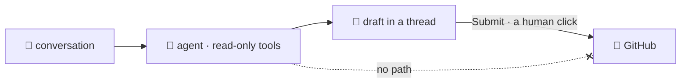

# Concepts

The bridge is built on four convictions. None of them are technical trivia —
each one is a choice about how the tool should feel to use, and each one is why a
particular piece of friction you'd expect simply isn't here. Understanding them
is enough to trust what the bot does on its own.

## GitHub is the source of truth

Your org already answers "who can touch which repo" — in GitHub, where that
information is actually maintained. Asking you to re-answer that question inside
Discord would mean two copies of the truth, and two copies always drift.

So the bridge only ever reads that state and reflects it. You **map a repo to a
channel** — the one grouping GitHub can't infer — and the bridge **creates an
access role for that repo**, fills it with everyone who can reach the repo on
GitHub (team members, direct collaborators, and org owners alike, since what
matters is *access*, not how you got it), and makes the **channel visible only to that role**. Grant
someone access on GitHub and the channel opens up for them; revoke it and it
closes — you don't touch a role or a permission by hand, because the moment you
did, GitHub and Discord would disagree.

The rule the bot lives by: it only touches what it created — the access roles and
the channels you mapped. Anything you set up yourself is off-limits, so "reflect
GitHub" can never mean "trample your manual work."

## You should never touch an ID

Discord identifies everything by long numeric snowflakes, and most bots make you
copy them — the server ID, each role ID, a channel ID pasted into a config file.
It's tedious and it's a silent trap: one wrong digit and the bot misbehaves in a
way that's miserable to debug.

The bridge refuses that entire category of error. The only thing you configure by
hand is your GitHub org name. Everything else is either **discovered** (the server
is the one the bot is in; an admin is anyone with *Manage Server*) or chosen
through the interface Discord already gives you — you **mention** a channel, you
**pick** a member, and repo and user names come from autocomplete backed by the
live GitHub API. If you can't fat-finger an ID, you can't misconfigure the bridge.

## Your configuration lives in Discord

The bridge keeps no database and no disk. The mappings it can't derive from GitHub
— which repos group into which channel, and who each GitHub user is on Discord —
are stored as ordinary messages in a private `#bot-config` channel it creates for
itself.

This isn't a shortcut, it's a feature. There's nothing to back up or pay for, it
survives every restart and redeploy for nothing, and — best of all — your
configuration is **something you can read**. Scroll the channel to see every
mapping in plain text. Above those lines the bot keeps one **live panel**: a
single message it edits in place (never reposts, so it never floods) showing the
whole current state with real mentions. The channel is both the storage and the
audit log, and they can't disagree because they're the same thing.

## A model may propose, only a human disposes

The bridge runs an LLM agent, and you reach it by [mentioning it](agent.md) or
with `/issue`. Either way it reads your conversation and your code. The obvious
worry is the obvious one: what happens when it gets something wrong?

The answer isn't a careful system prompt, because a prompt is a request and a
confused model can decline it. **The agent has no tool that writes to GitHub.**
It can search code, read files, list commits, look for duplicate issues, and read
who's mapped to whom. That's the complete list. Creating the issue is done by the
cog, in a different module, behind a button that only the person who asked can
press.

So the failure mode of a bad draft is a bad draft — visible in a thread, in front
of the people who were in the conversation, waiting for someone to press Submit
or Discard. It cannot be an issue nobody meant to file. That holds for a draft the
agent proposed because someone asked it to in conversation just as much as for one
from `/issue`: both land on the same card, behind the same button.

The same instinct runs through the rest of the design: the bot only touches what
it created, and the one write permission it holds on GitHub is used in exactly
one place.

## Why this shape

One last idea sits under the code rather than in front of the user, but it's worth
knowing: the bridge is built to **grow without disturbing what works**. Access
sync, notifications, issue drafting — each is a self-contained cog, and the ones
coming later (Google Workspace, voice, knowledge management; see the
[roadmap](roadmap.md)) slot in the same way, without touching the ones already
running.

`/issue` is the proof it holds. Adding an agent, a thread lifecycle, buttons and
a whole model integration touched no part of access sync or notifications — it
arrived as one more cog, and a webhook event it needed already went through the
same dispatch table everything else uses. That's a promise about the future more
than a feature you use today, but it's why adding the next capability won't put
the last one at risk.
