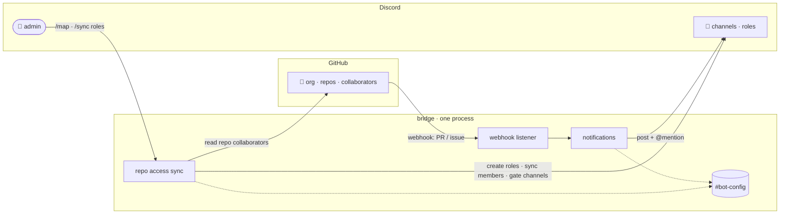

# Ranqia Workspace

A bridge between the **ranqialabs GitHub organization** and the **ranqialabs
Discord server**. It runs as a single bot process that keeps the two in sync and
turns GitHub activity into Discord notifications — mentioning the right people.

## What it does today (Phase 1)

- :lucide-users:{ .lg .middle } **Access, mirrored**

  ***

  Map a repo to a channel and the bot creates an access role, filling it with
  everyone who can reach the repo on GitHub — team members, direct collaborators,
  and org owners alike. GitHub is the source of truth.

  [:octicons-arrow-right-24: Commands](commands.md#sync-roles)

- :lucide-lock:{ .lg .middle } **Access follows the repo**

  ***

  Each mapped channel is visible only to its repo's access role — derived
  automatically from GitHub, no manual permissions.

  [:octicons-arrow-right-24: Commands](commands.md#sync-roles)

- :lucide-bell:{ .lg .middle } **Live notifications**

  ***

  When a PR is opened, a review is requested, or an issue is opened, the
  bridge posts to the repo's channel and @mentions the person involved.

  [:octicons-arrow-right-24: Events](commands.md#events)

- :lucide-mouse-pointer-click:{ .lg .middle } **No IDs, ever**

  ***

  Map repos and users with mentions and GitHub-backed autocomplete. You never
  copy a snowflake ID, so you can't misconfigure it.

  [:octicons-arrow-right-24: Concepts](concepts.md#you-should-never-touch-an-id)

## How it hangs together

The webhook listener and the Discord bot run in **one process, one event loop** —
no cron, no separate web service, no polling. And the mappings live in a Discord
channel, so there's **no database and no disk** to manage either.

## Next steps

- New here? Read the [Concepts](concepts.md).
- Setting it up? Go to [Configuration](configuration.md).
- Want to know what's coming? See the [Roadmap](roadmap.md).
