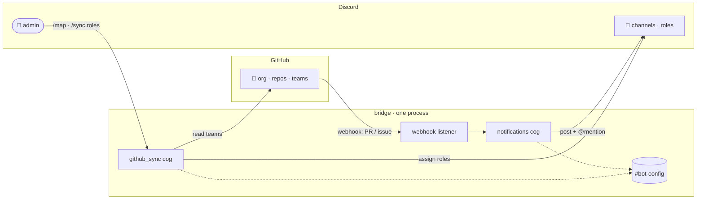

# Ranqia Workspace

A bridge between the **ranqialabs GitHub organization** and the **ranqialabs
Discord server**. It runs as a single bot process that keeps the two in sync and
turns GitHub activity into Discord notifications — mentioning the right people.

## What it does today (Phase 1)

- :lucide-users:{ .lg .middle } **Sync teams → roles**

  ***

  An admin runs `/sync roles` and members get the Discord role that matches
  their GitHub team.

  [:octicons-arrow-right-24: Commands](commands.md#sync-roles)

- :lucide-mouse-pointer-click:{ .lg .middle } **No IDs, ever**

  ***

  Map teams and repos with commands that autocomplete from GitHub and take
  Discord mentions. You never copy a snowflake ID.

  [:octicons-arrow-right-24: Commands](commands.md)

- :lucide-bell:{ .lg .middle } **Live notifications**

  ***

  When a PR is opened, a review is requested, or an issue is opened, the
  bridge posts to the repo's channel and @mentions the person involved.

  [:octicons-arrow-right-24: Events](commands.md#events)

- :lucide-blocks:{ .lg .middle } **Built to grow**

  ***

  Each domain is a cog. New domains — voice, summarization, Google Workspace —
  plug in without touching the existing ones.

  [:octicons-arrow-right-24: Roadmap](roadmap.md)

## How it hangs together

The webhook listener and the Discord bot run in **one process, one event loop** —
no cron, no separate web service, no polling. And the mappings live in a Discord
channel, so there's **no database and no disk** to manage either.

## Next steps

- New here? Read [How it works](how-it-works.md).
- Setting it up? Go to [Configuration](configuration.md).
- Want to know what's coming? See the [Roadmap](roadmap.md).
