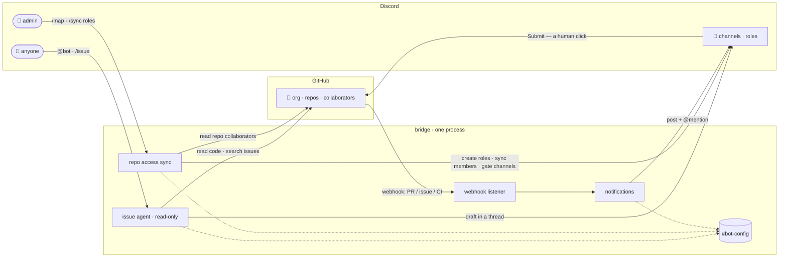

# Ranqia Workspace

A bridge between the **ranqialabs GitHub organization** and the **ranqialabs
Discord server**. It runs as a single bot process that keeps the two in sync and
turns GitHub activity into Discord notifications — mentioning the right people.

## What it does today

- :lucide-users:{ .lg .middle } **Access, mirrored**

  ***

  Map a repo to a channel and the bot creates an access role, filling it with
  everyone who can reach the repo on GitHub — team members, direct collaborators,
  and org owners alike. GitHub is the source of truth.

  [:octicons-arrow-right-24: Commands](commands.md#sync-roles)

- :lucide-lock:{ .lg .middle } **Access follows the repo**

  ***

  Each mapped channel is visible only to its repo's access role — derived
  automatically from GitHub, no manual permissions.

  [:octicons-arrow-right-24: Commands](commands.md#sync-roles)

- :lucide-bell:{ .lg .middle } **Live notifications**

  ***

  When a PR is opened, a review is requested, or an issue is opened, the
  bridge posts to the repo's channel and @mentions the person involved.

  [:octicons-arrow-right-24: Events](commands.md#events)

- :lucide-pen-line:{ .lg .middle } **An agent in the conversation**

  ***

  `/issue` reads the discussion, grounds it in the actual code, and drafts an
  issue in a thread. Nothing is filed until someone clicks Submit.

  [:octicons-arrow-right-24: Talking to the agent](agent.md)

- :lucide-mouse-pointer-click:{ .lg .middle } **No IDs, ever**

  ***

  Map repos and users with mentions and GitHub-backed autocomplete. You never
  copy a snowflake ID, so you can't misconfigure it.

  [:octicons-arrow-right-24: Concepts](concepts.md#you-should-never-touch-an-id)

- :lucide-database-zap:{ .lg .middle } **No database, no disk**

  ***

  Every mapping is an ordinary message in a private `#bot-config` channel. Your
  configuration is something you can read.

  [:octicons-arrow-right-24: Concepts](concepts.md#your-configuration-lives-in-discord)

## How it hangs together

```mermaid
flowchart LR
  subgraph gh [GitHub]
    GH["🐙 org · repos · collaborators"]
  end

  subgraph bot [bridge · one process]
    direction TB
    W["webhook listener"]
    N["notifications"]
    S["repo access sync"]
    I["issue agent · read-only"]
    CFG[("#bot-config")]
    W --> N
    N -.-> CFG
    S -.-> CFG
    I -.-> CFG
  end

  subgraph dc [Discord]
    DC["📣 channels · roles"]
    A(["👤 admin"])
    U(["👤 anyone"])
  end

  GH -- "webhook: PR / issue / CI" --> W
  N -- "post + @mention" --> DC
  A -- "/map · /sync roles" --> S
  S -- "read repo collaborators" --> GH
  S -- "create roles · sync members · gate channels" --> DC
  U -- "@bot · /issue" --> I
  I -- "read code · search issues" --> GH
  I -- "draft in a thread" --> DC
  DC -- "Submit — a human click" --> GH
```

The webhook listener and the Discord bot run in **one process, one event loop** —
no cron, no separate web service, no polling. And the mappings live in a Discord
channel, so there's **no database and no disk** to manage either.

Note where the arrow into GitHub for a new issue starts: at **Submit**, not at
the agent. Everything the agent itself can do to GitHub is a read — however the
draft got there.

## Next steps

- :lucide-lightbulb:{ .lg .middle } **New here?**

    ---

    Three convictions explain every design decision, and why friction you'd
    expect isn't here.

    [:octicons-arrow-right-24: Concepts](concepts.md)

- :lucide-settings:{ .lg .middle } **Setting it up?**

    ---

    GitHub App, Discord bot, deploy, wiring. Twenty minutes the first time.

    [:octicons-arrow-right-24: Setup](configuration.md)

- :lucide-terminal:{ .lg .middle } **Using it?**

    ---

    Every slash command and every webhook event the bridge reacts to.

    [:octicons-arrow-right-24: Commands & events](commands.md)

- :lucide-map:{ .lg .middle } **What's next?**

    ---

    What's planned, and the limits worth knowing about today.

    [:octicons-arrow-right-24: Roadmap](roadmap.md)

