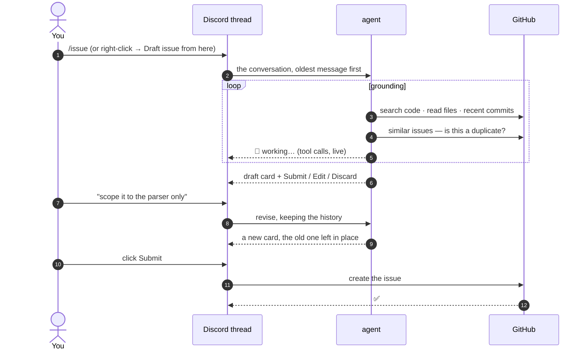

# Drafting issues

Good issues get written when the discussion is still fresh, and that is exactly
when nobody wants to stop and write one. `/issue` reads the conversation you
point it at, grounds it in the actual code, and proposes a draft you can argue
with — in a thread, in front of everyone who was in the discussion.

!!! danger "The agent cannot write to GitHub"

    There is no create-issue tool on the agent. Every tool it has is read-only,
    and submitting is the **cog's** job, behind a human click. A confused model
    can waste tokens; it cannot open an issue. That isn't a policy or a system
    prompt you're trusting — it's the shape of the code.

## The flow



The thread is the point: everyone in the conversation can watch the draft take
shape, but only whoever ran the command can act on it.

## Starting a draft

There are two ways in, and they differ only in how you choose the messages.

=== "Slash command"

    ```text
    /issue [prompt:‹what it's about›] [since_message:‹link›] [last:20] [repo:‹owner/name›]
    ```

    | Parameter | Description |
    | :-------- | :---------- |
    | `prompt` | What the issue is about — steers the draft. Optional but worth it |
    | `since_message` | A message **link** — reads from there forward. Right-click → *Copy Message Link* |
    | `last` | How many messages to read (default 20, max 100). Ignored with a link |
    | `repo` | Force the target repo instead of inferring it from the channel |

=== "Right-click a message"

    **Right-click a message → Apps → Draft issue from here.**

    A modal asks what the issue is about, then it drafts from that message
    forward — the same as passing `since_message`. Picking the message where a
    discussion started is usually faster than counting how many messages it ran
    for.

!!! tip "A link beats a count"

    `last:20` makes you guess how far back the discussion goes. A message link
    says *start here* and reads forward to the end of the conversation (up to
    100 messages), which is almost always what you meant.

### What it reads

The transcript is what people actually wrote, oldest first, with each speaker
named the way the agent will see them again. Alongside the text:

- [x] **Images** are downloaded and sent to the model as image content — a
      screenshot of a stack trace is read, not ignored.
- [x] **Text and JSON attachments** are inlined in full, and if one is too long
      the transcript says so in-band, so the model can't mistake the first
      100k characters for the whole file.
- [x] **Other attachments** are noted by name and type.
- [ ] **Bot messages are skipped** — otherwise the bridge's own notification
      cards read as conversation and it drafts issues about them.

Attachments come back as bytes rather than CDN links: Discord signs its URLs
with an expiry, so handing one to a model's fetcher works until it silently
doesn't.

## What the agent does

It reads the conversation, then uses read-only GitHub tools to ground it in the
code — because an issue that cites `path/to/file.py:41` is one someone can start
on, and an issue that paraphrases a hunch isn't.

| Tool | What it's for |
| :--- | :------------ |
| `search_code` | find a symbol or string across the org |
| `read_file` | read a file, optionally at a branch, tag or commit |
| `list_dir` | get oriented before reading |
| `recent_commits` | did this regress? who touched it last? |
| `similar_issues` | is this already filed? |
| `repo_labels` | the labels this repo actually has |
| `teammates` | mapped GitHub logins, and the names people call them by |

It may **read any repository in the org**, not just the one the issue gets filed
against — following a bug from a client into its service is often the whole
job. Where it gets *filed* is restricted to the candidate repos.

!!! info "Why `teammates` exists"

    People ask for each other by first name; GitHub only accepts logins. The
    agent resolves a name to a login through the [`/map user`](commands.md#map-user)
    mappings, read fresh on every call — so a `/map user` run while a draft is
    open reaches the next revision. If nobody matches, it leaves the assignee
    empty and asks in *Open questions* rather than guessing: a login that doesn't
    exist gets rejected, and one that does assigns a stranger.

### Which repo it can pick

The candidates come from the channel: a channel mapped to one repo settles it,
otherwise every mapped repo is a candidate. Passing `repo:` forces one. If the
agent proposes something outside that list, it's rejected and asked again — so a
draft can never be filed somewhere you didn't offer.

An unmapped channel with no mapped repos at all can't draft: run
[`/map repo`](commands.md#map-repo) first.

## The draft card

The result is a card with the proposed title, body, repo, assignee, labels, and
whatever the agent couldn't work out.

<div class="grid cards" markdown>

- :lucide-badge-check:{ .lg .middle } **Confidence**

    ---

    Green, blue or grey, by how well the conversation actually specifies the
    work. `high` only when someone could start on it as written.

- :lucide-circle-help:{ .lg .middle } **Open questions**

    ---

    What blocks someone from starting — not design choices whose answer *is* the
    work. A short draft with honest questions beats a confident wrong one.

- :lucide-triangle-alert:{ .lg .middle } **Assignee warning**

    ---

    If the proposed assignee isn't a mapped login, the card says so — GitHub may
    reject the assignment.

- :lucide-copy:{ .lg .middle } **Duplicate note**

    ---

    If `similar_issues` turned up a real duplicate, it's called out at the top of
    the body, with a link.

</div>

### Acting on it

| Button | What happens |
| :----- | :----------- |
| **Submit** | Creates the issue on GitHub, posts a card in the repo channel, archives the thread |
| **Edit** | A modal with the title and body, pre-filled — your text is taken verbatim, no model round trip |
| **Discard** | Drops the draft and archives the thread |

Only whoever ran `/issue` can press them. Everyone else in the thread is
commenting on the draft, not steering it.

!!! tip "Revise by talking"

    Type in the thread and the agent revises: *"scope it to the parser"*, *"add
    the repro from Ana's message"*, *"assign it to me"*. It keeps its history, so
    a revision doesn't re-read every file it already read. Each revision posts a
    **new** card and leaves the old one — the thread is the record of how the
    issue got its shape.

The submitted issue carries a link back to the Discord thread, so the discussion
that produced it is always one click away.

## House style

The agent is told how this org writes issues, so drafts come out in the shape
your repo already uses:

- `title` is `type: what changes` — `fix`, `feat`, `chore`, `refactor` — and a
  reader scanning the list can tell what it is from the title alone.
- The body opens with one or two sentences stating the problem. No `## Summary`
  heading above them.
- `##` sections only when there's something to separate: `## Reproducing`,
  `## Cause`, `## Expected`, `## Scope`. An empty template section is worse than
  no section.
- 1500–2500 characters. A tight issue gets picked up; a long one gets skipped.
- Cite `path/to/file.py:line` where the work lands, and quote the message that
  settled something instead of paraphrasing it.

## Limits and failure

??? note "Three drafts at a time"

    Each open draft holds its images and agent history in memory, so the bridge
    caps concurrent drafts. Submit or discard one to free a slot. A draft whose
    thread was deleted is swept automatically.

??? note "A restart loses the conversation, not the draft"

    Sessions live in memory. After a restart the **buttons still work** — each
    one rebuilds from its own `custom_id`, and the draft is recovered from the
    card itself, which carries its own data invisibly. What's gone is the agent's
    history, so revising by talking no longer works; the bot says so once per
    thread rather than swallowing what you typed.

    The body recovered this way is the *preview* text, so a body longer than
    1500 characters comes back truncated. Every other field is exact.

??? note "When the model fails"

    A failed draft doesn't kill the cog — the status message is replaced with why
    it failed, quoting the provider's own words. Rate limits, a rejected API key
    and an unreachable provider each say what they are, because the fix is
    different for each and none of them is *"try again"*.

??? note "When `/issue` is switched off"

    Without `OPENAI_API_KEY` (or with a model string the provider doesn't know)
    the agent fails to build and `/issue` reports that it's disabled. The rest of
    the bridge — access sync, notifications — runs exactly as before.

## What it needs

`/issue` is the one feature with requirements beyond the rest of the bridge:

- **Message Content intent**, enabled in the Discord Developer Portal. Without
  it the bot receives empty message text and there is no conversation to read.
  See [Setup](configuration.md#2-the-discord-bot).
- **Issues → Read and write** on the GitHub App, since Submit creates the issue.
  See [Setup](configuration.md#1-the-github-app).
- **A model API key** — `OPENAI_API_KEY` by default. Override the model with
  `ISSUE_MODEL` (any [pydantic-ai] model string).

[pydantic-ai]: https://ai.pydantic.dev/models/
